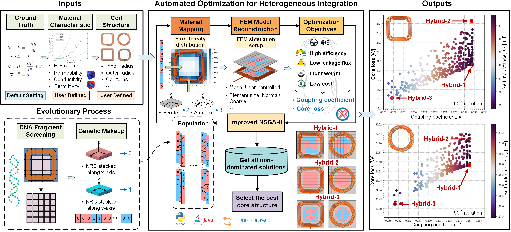

# Creating an Inductive Power Transfer Model: A Comprehensive Guide from Scratch

`-` An open-source, universal simulation model based on Python and Java is available in this folder for future coupler design in IPT systems.

`-` Users can modify/add various parameters in the code for their purposes, including the coil structures, material properties, mesh, solver setting, etc.

`-` It is provided for research and educational purposes only. If you find this Python-based COMSOL simulation model useful, please kindly reference our paper.

# Creating an Inductive Power Transfer Model: A Comprehensive Guide from Scratch